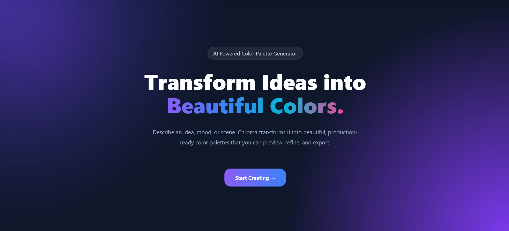
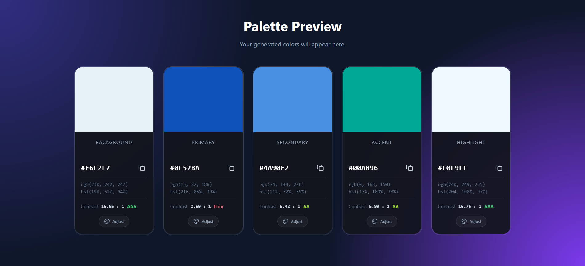

# 🎨 Chroma — Create Your Color Story

*An AI-powered color palette generator that transforms moods, aesthetics, ideas, and descriptions into harmonious, customizable color palettes.*

🌐 **Live Demo:** [Launch Chroma](https://chroma-6n2spm7j4-josna2.vercel.app/)

---

## 📌 Table of Contents
- [📸 Preview](#preview-section)
- [✨ Features](#features-section)
- [🛠️ Tech Stack](#tech-stack-section)
- [🚀 Getting Started](#getting-started-section)
- [🎯 Project Vision](#project-vision-section)
- [🤝 Contributing](#contributing-section)
- [📄 License](#license-section)
- [👩‍💻 Author](#author-section)
- [⭐ Support](#support-section)

---

## <a id="preview-section"></a>📸 Preview

<p align="center">
  
</p>

<p align="center">
  
</p>

---

## <a id="features-section"></a>✨ Features

### 🤖 AI Palette Generation
- Describe a mood, aesthetic, object, place, theme, or feeling.
- AI interprets the description and creates a visually cohesive palette.
- Each generated palette contains five semantic color roles.

### 🎨 Semantic Color Roles
Every palette is organized into meaningful roles:
- **Background** — primary surface or page background.
- **Primary** — dominant brand or interface color.
- **Secondary** — supporting color that complements the primary.
- **Accent** — attention-grabbing supporting color.
- **Highlight** — brighter color for emphasis and visual details.

### 🃏 Interactive Palette Cards
- View each generated color in its dedicated role-based card.
- Display HEX, RGB, and HSL values.
- View contrast ratio and accessibility rating.
- Copy individual colors directly to the clipboard.

### 🔐 Secure AI Integration
- Gemini API requests are handled through a backend API.
- API credentials are stored in environment variables.
- .env.example is provided to show the required configuration.

---

## <a id="tech-stack-section"></a>🛠️ Tech Stack

| Technology | Purpose |
| :--- | :--- |
| **React** | UI Component Library |
| **Vite** | Frontend Build Tool and Development Environment |
| **CSS3** | Custom Styling, Responsive Layouts, & Animations |
| **Lucide React** | Visual Interface Icons |
| **Google Gemini API** | AI-Powered Palette Generation |
| **Node.js** | Backend Runtime |
| **Express.js** | Backend API Server |
| **CORS** | Secure Frontend-Backend Communication |
| **dotenv** | Environmental Variable Management |
| **JavaScript** | Application Logic and Color Processing |

---

## <a id="getting-started-section"></a>🚀 Getting Started

### Prerequisites
Make sure you have the following installed on your local machine:
- **Node.js** (v18.0.0 or higher)
- **npm** (v9.0.0 or higher)
- **A Google Gemini API key**

### Installation & Local Setup

1. **Clone the repository:**
   ```bash
   git clone https://github.com/josna26/chroma.git
   cd chroma
   ```

2. **Install dependencies:**
   ```bash
   npm install
   ```

3. **Create your environment file:**
   
   Create a .env file in the project root:
   
   GEMINI_API_KEY=your_gemini_api_key

   > Never commit your .env file or expose your API key publicly

4. **Start the backend server:**
   ```bash
   npm run server
   ```

   The backend API will run on:
   
   [http://localhost:3001](http://localhost:3001)

5. **Start the frontend development server:**
   
   Open another terminal in the project directory and run:
   ```bash
   npm run dev
   ```

6. **Open Chroma:**

   Navigate to:

   [http://localhost:5173](http://localhost:5173)

### Production Build
To create an optimized production build of the frontend:
```bash
npm run build
```

To preview the production build locally:
```bash
npm run preview
```

---

## <a id="project-vision-section"></a>🎯 Project Vision
Choosing colors for a project can be surprisingly difficult.

A palette may contain individually beautiful colors but still feel disconnected when placed together. **Chroma** was created to make that process more intuitive by allowing users to describe what they want instead of manually searching through color combinations.

Chroma combines AI-generated color suggestions with interactive editing and accessibility information so that a generated palette can be explored, refined, and adapted to different creative projects.

Rather than treating color as a collection of isolated HEX values, Chroma presents it as a **visual system** with meaningful roles and relationships.

---

## <a id="contributing-section"></a>🤝 Contributing
Contributions, ideas, and feedback are always welcome! 

1. Fork the Project
2. Create your Feature Branch (`git checkout -b feature/AmazingFeature`)
3. Commit your Changes (`git commit -m 'Add some AmazingFeature'`)
4. Push to the Branch (`git push origin feature/AmazingFeature`)
5. Open a Pull Request

---

## <a id="license-section"></a>📄 License
This project is licensed under the **MIT License**. See the `LICENSE` file for details.

---

## <a id="author-section"></a>👩‍💻 Author

**Josna John**  
*Computer Science Engineering Student • Full Stack Developer • Product Builder*

- GitHub: [@josna26](https://github.com/josna26)
- LinkedIn: [Josna John](https://www.linkedin.com/in/josna-john-32a1a1324)


---

## <a id="support-section"></a>⭐ Support
If you enjoyed Chroma, consider giving the project a ⭐ on GitHub! 
It helps support the project and motivates future development.
